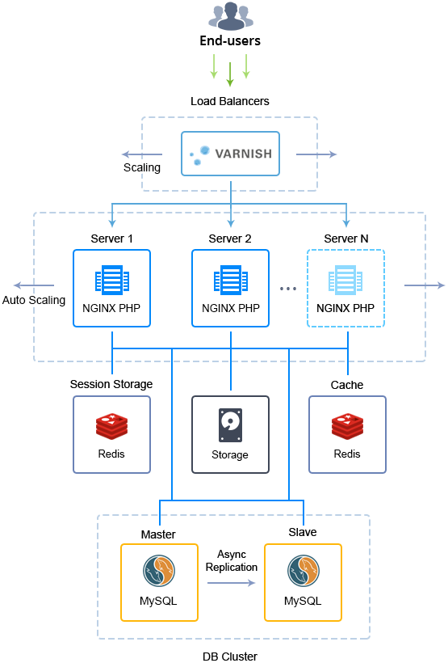
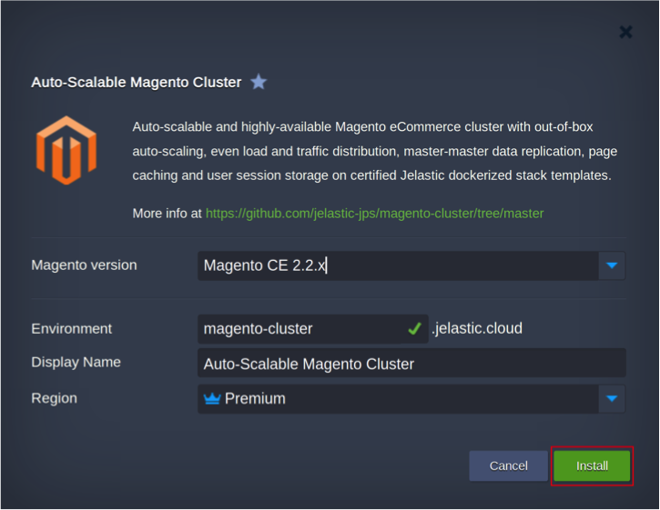
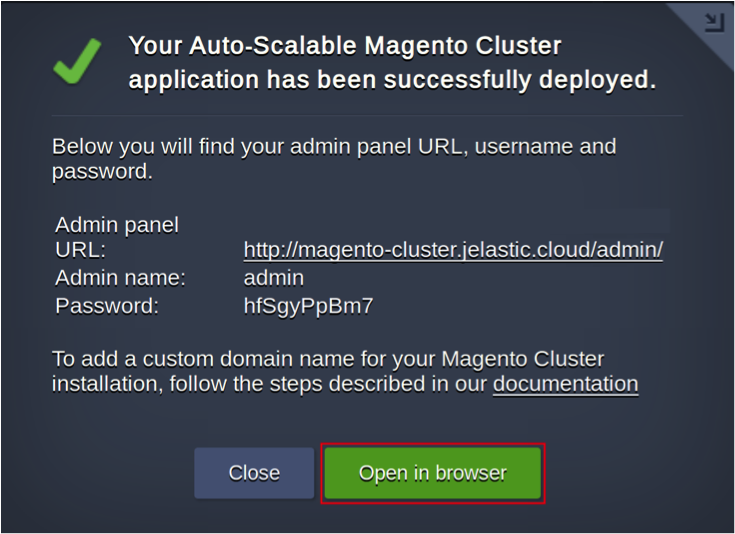

# Auto-Scalable Magento Cluster.

Magento, PHP based eCommerce platform, is packaged as an advanced highly reliable and auto-scalable cluster on top of certified Jelastic dockerized stack templates with the following topology:

* **Varnish** load balancer is supplemented with NGINX server as HTTPS proxy
* Scalable **NGINX PHP** application servers with preconfigured [automatic horizontal scaling](https://docs.jelastic.com/automatic-horizontal-scaling) to handle load spikes
* [**MySQL DB Cluster**](https://github.com/jelastic-jps/mysql-cluster) with asynchronous master-slave replication to ensure high availability, fault tolerance and data security
* **Redis** storage system to retain user session parameters  
* **Redis** node for the Magento content cache storing
* Dedicated [**Data Storage**](https://docs.jelastic.com/data-storage-container) node

More details can be found at the article [Running Auto-Scalable Magento Platform in Containers](https://jelastic.com/blog/auto-scalable-magento-cluster-in-containers/).

## Deployment to the Cloud
Click the **Deploy** button below, specify your email address within the widget, choose one of the [Jelastic Public Cloud providers](https://jelastic.com/install-application/?manifest=https://raw.githubusercontent.com/jelastic-jps/magento-cluster/master/manifest.jps&keys=app.jelastic.eapps.com;app.cloud.hostnet.nl;app.jelastichosting.nl;app.appengine.flow.ch;app.jelasticlw.com.br;app.mircloud.host;app.jcs.opusinteractive.io;app.paas.quarinet.eu) and press **Install**.

*Note:* If you are already registered at Jelastic, you can deploy this cluster by importing [the package manifest raw link](https://raw.githubusercontent.com/jelastic-jps/magento-cluster/master/manifest.jps) within the dashboard.

## Installation Process
In the opened confirmation window at Jelastic dashboard, type the *Environment* name, optionally, customize its [Display Name](https://docs.jelastic.com/environment-aliases). Then, select the preferable [region](https://docs.jelastic.com/environment-regions) (if several are available) and click on **Install**.

Once the deployment is finished, you’ll see the appropriate success pop-up with access credentials to your administration Magento panel, whilst the same information will be duplicated to your email box.

So now you can just click on the **Open in browser** button within the shown frame and start filling your highly available and reliable Magento installation with the required content, being ready to handle as much users as your service requires.

## Magento Managed Hosting Business
To start offering this solution to your customers please follow to [Auto-Scalable Clusters for Managed Cloud Business](https://jelastic.com/apaas/)
